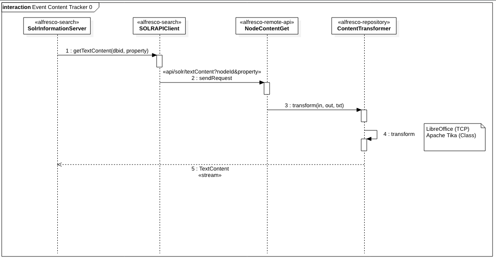
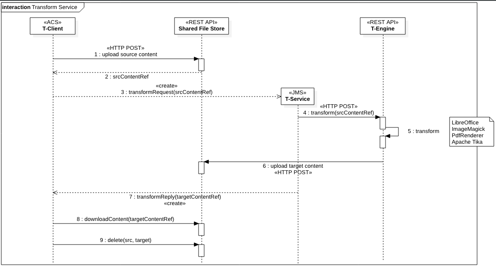
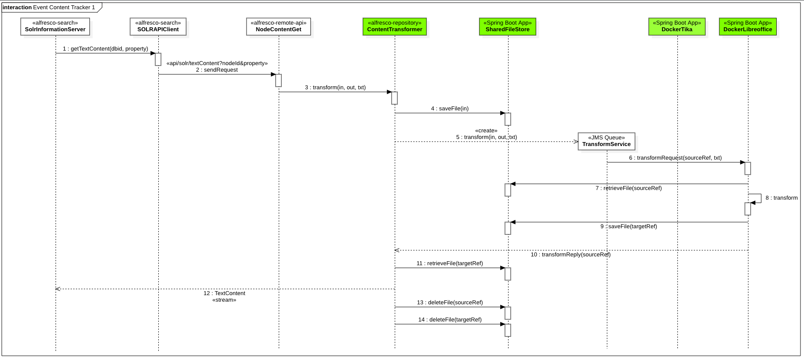
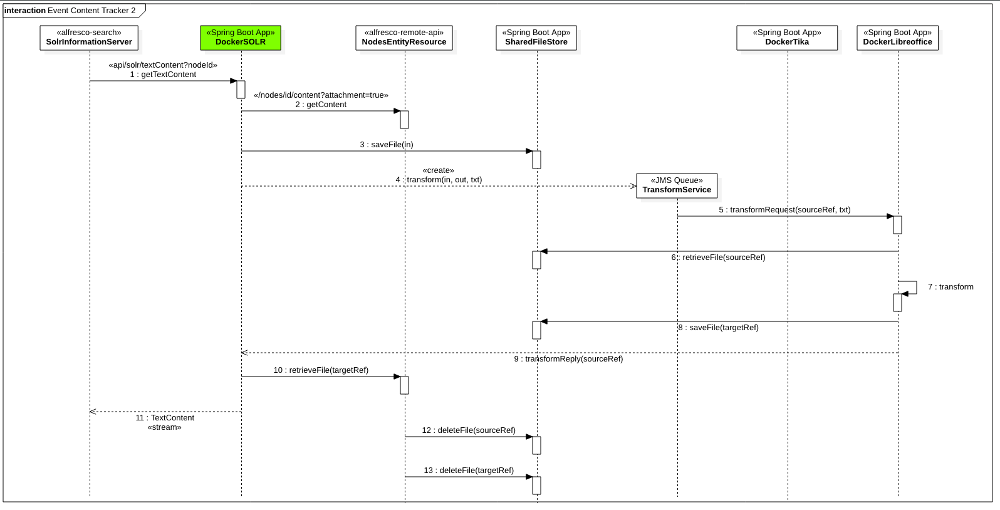
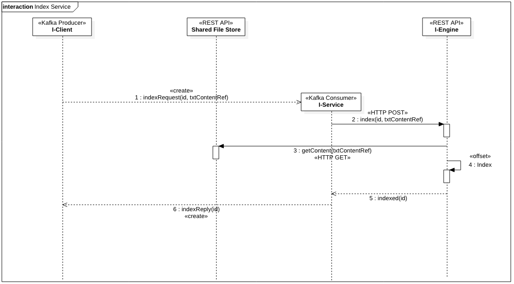
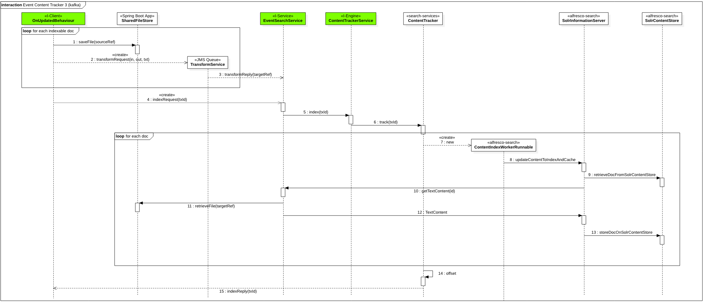

# Event Based Content Tracker for Alfresco


**Contents**

- [Context](#context)
- [How Text Extraction Works](#how-text-extraction-works)
- [How the New Transform Service Works](#how-the-new-transform-service-works)
- [Alternatives evaluation](#alternatives-evaluation)
  - [1 - No Change to Search Service](#1---no-change-to-search-service)
  - [2 - New Microservice in the Middle](#2---new-microservice-in-the-middle)
  - [3 - Event Oriented Content Tracking](#3---event-oriented-content-tracking)
- [Findings](#findings)
- [References](#references)

## Context

The current approach of the Content Tracker in Search Service is to query Solr for any *dirty* documents which it then fetches from Alfresco. Once the content is successfully obtained from Alfresco, it marks it clean which eventually get committed to the index. This approach will need to be modified as it applies pressure on Alfresco on every call to get the content. Taking an event based approach where the Content Tracker subscribes to a *topic* with policy the specific behaviour will allow to get the extracted content when ready.

There are currently different alternatives to be considered:

1. No change to Search Service. The repository will off load the transformation to Transform Service and pause the thread requesting the transformation until the content is transformed.
2. Introduce a new microservice that sits between Search Service and the Transform Service. The content is off loaded to Transform Service and the microservice stores the content for Search Service to ingest.
3. The Content Tracker that consumes content based on events

This document describes and explores these alternatives to provide the background required to produce an **ADR** (Architectural Decision Record) related to this topic.


## How Text Extraction Works

Following information has been extracted from Alfresco Content Services 6.1 and Alfresco Search Services 1.3.



**Components referenced in the figure**

* [alfresco-search](https://github.com/Alfresco/SearchServices/tree/master/alfresco-search): Alfresco SOLR Application, deployed in SOLR Jetty web application `solr.war` as library
* [alfresco-remote-api](https://github.com/Alfresco/alfresco-remote-api): REST API Layer for Alfresco Content Services, deployed in Alfresco Tomcat web application `alfresco.war` as library
* [alfresco-repository](https://github.com/Alfresco/alfresco-repository): Metadata and content storage for Alfresco Content Services, deployed in Alfresco Tomcat web application `alfresco.war` as library
* [Apache Tika](https://github.com/Alfresco/alfresco-tika): Detection and extraction of metadata and text from content, deployed in Alfresco Tomcat web application `alfresco.war` as library
* [LibreOffice](https://www.libreoffice.org): This program is used in *serverless* mode to provide content transformation, installed locally on a server. It can be used *DIRECT* as TCP service (usually listening in port 8100) or via [JodConverter](http://docs.alfresco.com/community/concepts/OOo-subsystems-intro.html).

**Text Extraction Process**

Since more detailed information on the Content Tracker [1] is available, the text extraction process happens inside `SolrInformationServer` class. When *dirty* documents are being indexed, `SOLRAPIClient` is invoked (1) to retrieve Text Content from Alfresco Repository using the REST API (2)

```
/api/solr/textContent?nodeId=<id>&propertyQName=<name>
```

* `id` is the identifier of the document in database
* `propertyQName` is the identifier of the property representing the content of the document, `{http://www.alfresco.org/model/content/1.0}content` by default

Both classes are part of [Alfresco Solr Application](https://github.com/Alfresco/SearchServices/tree/master/alfresco-search).

The request to `textContent` is processed by `NodeContentGet` Web Script (3) at [Alfresco Remote API](https://github.com/Alfresco/alfresco-remote-api). This component finds the right Content Transformer to produce the required Text Content from the original mime type. *Apache Tika*, as local class invocation, and *LibreOffice*, as TCP service or using JodConverter [2], are the Content Transformers available.

Once the transformation has been performed (4) by the Content Transformer, the Stream is returned back to `SolrInformationServer` (5) and the indexing process continues.

*Note*: `NodeContentGet` web script is using a deprecated API to find the right transformer: [getActiveTransformers()](https://github.com/Alfresco/alfresco-repository/blob/alfresco-repository-7.60/src/main/java/org/alfresco/repo/content/ContentServiceImpl.java#L897).


## How the New Transform Service Works

Before going on with the alternatives evaluation, a quick overview of the new **Alfresco Transform Service** is provided.

Since ACS 6.1, transformations are performed by different *microservices* named as *Transform Engines* (T-Engine):

* [alfresco-docker-alfresco-pdf-renderer](https://git.alfresco.com/Repository/alfresco-docker-transformers/tree/master/alfresco-docker-alfresco-pdf-renderer) includes a PDFium [3] *wrapper* named Alfresco PDF Renderer [4] to provide operations on PDF files, as extracting the first page
* [alfresco-docker-imagemagick](https://git.alfresco.com/Repository/alfresco-docker-transformers/tree/master/alfresco-docker-imagemagick) includes an ImageMagick [5] *wrapper* to provide operations on images, as generating a thumbnail
* [alfresco-docker-libreoffice](https://git.alfresco.com/Repository/alfresco-docker-transformers/tree/master/alfresco-docker-libreoffice) includes a LibreOffice *wrapper* to provide transformation operations from a source mime type to a target mime type
* [alfresco-docker-tika](https://git.alfresco.com/Repository/alfresco-docker-transformers/tree/master/alfresco-docker-tika) exposes Apache Tika [6] features for mime type transformation

>> These components are only available for Enterprise releases of Alfresco, so links in the text may be unavailable to Community users.

A *Transform Engine* is a dockerized REST API providing Transform Services and *renderization* operations. The [Transform Service](https://github.com/Alfresco/alfresco-transform-service) is a message router, currently working with ActiveMQ, to provide Transformation Requests to Transform Engines and to manage Transformation Replies from Transform Engines. This *router* finds the right Transform Engine for a Transformation Request depending on the source and target mime types.

To reduce the transit of content between the services, a dockerized [Shared File Store](https://github.com/Alfresco/alfresco-shared-file-store) REST API is used to have a single point of storage. When a transformation operation is requested, the source file is uploaded to the *Shared File Store* and when the transformation operation has been performed, the target file is uploaded also to that *Shared File Store*. Once the operation has been consumed, both source and target files are removed from *Shared File Store*.



**Components referenced in the figure**

* [T-Client](https://github.com/Alfresco/alfresco-repository/blob/alfresco-repository-7.60/src/main/java/org/alfresco/messaging/camel/routes/OnContentUpdateRenditionRoute.java#L88): Currently ACS is a transformer client, requesting transformation operations to *Transform Service* via JMS events
* [Shared File Store](https://github.com/Alfresco/alfresco-shared-file-store): REST API Layer to share contents between a *T-Client* and the *T-Engine*
* [T-Service](https://github.com/Alfresco/alfresco-transform-service): Alfresco Transform Service to route JMS Events to T-Engines
* [T-Engine](https://git.alfresco.com/Repository/alfresco-docker-transformers): Transformation Engines provides transformation operations on content, consuming the source from `Shared File Store` and producing the target also in `Shared File Store`. Currently Apache Tika, LibreOffice, ImageMagick and PDF Renderer are available

>> T-Engine is currently only available for Enterprise releases of Alfresco, so links in the text may be unavailable to Community users.

**Transformation Process**

*T-Client* uploads the source content to `Shared File Store` using a REST API invocation (1) to retrieve a *srcContentRef* (2).

After that, *T-Client* creates a new `TransformRequest` event with the *srcContentRef* and the requested operation (3).

*T-Service* consumes the event and invokes to the right *T-Engine* (LibreOffice, ImageMagick, PdfRenderer, Apache Tika) with the *srcContentRef* and the operation requested (4).

The *T-Engine* performs the transformation (5) and stores the result in the `Shared File Store` to retrieve a *targetContentRef* (6).

*T-Service* creates a new `TransformReply` event with the *targetContentRef* that is consumed by *T-Client* (7), where the transformed content is downloaded from `Shared File Store` using a REST API invocation (8). After that, for instance, this downloaded content is stored in the repository as a new *rendition*, so the temporary copy at `Shared File Store` is not required anymore.

Both source and target files can be deleted from `Shared File Store` after the operation ends successfully (9).

*Note*. Detailed JSON syntax for `Transform Request` and `Transform Reply` are available at [Spec for Transform Request & Reply](https://github.com/Alfresco/alfresco-transform-service/blob/master/docs/transformation-request-reply.md)


## Alternatives evaluation

Below different alternatives for integrating Content Tracking with the New Transform Service are described.


### 1 - No Change to Search Service

The repository will off load the transformation to Transform Service and pause the thread requesting the transformation until the content is transformed.



**Components referenced in the figure**

* [alfresco-search](https://github.com/Alfresco/SearchServices/tree/master/alfresco-search): Alfresco SOLR Application, deployed in SOLR Jetty web application `solr.war` as library
* [alfresco-remote-api](https://github.com/Alfresco/alfresco-remote-api): REST API Layer for Alfresco Content Services, deployed in Alfresco Tomcat web application `alfresco.war` as library
* [alfresco-repository](https://github.com/Alfresco/alfresco-repository): Metadata and content storage for Alfresco Content Services, deployed in Alfresco Tomcat web application `alfresco.war` as library
* [Shared File Store](https://github.com/Alfresco/alfresco-shared-file-store): REST API Layer to share contents between a *T-Client* and the *T-Engine*
* [T-Service](https://github.com/Alfresco/alfresco-transform-service): Alfresco Transform Service to route JMS Events to T-Engines
* [DockerTika](https://git.alfresco.com/Repository/alfresco-docker-transformers/tree/master/alfresco-docker-tika) REST API Layer for *T-Engine* based in Tika
* [DockerLibreoffice](https://git.alfresco.com/Repository/alfresco-docker-transformers/tree/master/alfresco-docker-libreoffice) REST API Layer for *T-Engine* based in LibreOffice

>> T-Engine components, like Tika and LibreOffice, are only available for Enterprise releases of Alfresco, so links in the text may be unavailable to Community users.

**Transformation Process**

From SOLR side, the code remains unchanged, so the transformation to text is requested to `NodeContentGet` web script (2) as before.

From this point, *Content Transformer* stores the source content in the `Shared File Store` to retrieve the `sourceRef` (4) and creates a new *Transform Request* event to be consumed by *Transform Service* (5).

*Transform Service* uses routing component to find the right *Transform Engine* (Tika, LibreOffice...) and perform the invocation with the `sourceRef` and the target media type (TXT) to the *Transform Engine* (6).

Source Content is retrieved from `Shared File Store` using `sourceRef` (7) and the transformation is performed (8) and the result is stored in the `Shared File Store` to retrieve the `targetRef` (9).

After that, *Transform Engine* creates a new *Transform Reply* event (10) to be consumed by *Content Transformer*, where the content is retrieved from `Shared File Store` using `targetRef` (11).

As the original request to `NodeContentGet` has been paused while performing the transformation, *Content Transformer* returns the TextContent Stream back and the response is delivered to SOLR (12).

Both source and target files can be deleted from `Shared File Store` after the operation ends successfully (13,14).

**Consequences**

No consequences for *Search Services* are expected from applying this alternative.


### 2 - New Microservice in the Middle

Introduce a new microservice that sits between Search Service and the Transform Service. The content is off loaded to Transform Service and the microservice stores the content for Search Service to ingest.



**Components referenced in the figure**

* [alfresco-search](https://github.com/Alfresco/SearchServices/tree/master/alfresco-search): Alfresco SOLR Application, deployed in SOLR Jetty web application `solr.war` as library
* *ContentTracker*: New REST API Layer based in Spring Boot App (to be dockerizable) to be designed. This component is also publishing `TransformRequest` events to be consumed by *Transform Service*
* [alfresco-remote-api](https://github.com/Alfresco/alfresco-remote-api): REST API Layer for Alfresco Content Services, deployed in Alfresco Tomcat web application `alfresco.war` as library
* [Shared File Store](https://github.com/Alfresco/alfresco-shared-file-store): REST API Layer to share contents between a *T-Client* and the *T-Engine*
* [T-Service](https://github.com/Alfresco/alfresco-transform-service): Alfresco Transform Service to route JMS Events to T-Engines
* [DockerTika](https://git.alfresco.com/Repository/alfresco-docker-transformers/tree/master/alfresco-docker-tika) REST API Layer for *T-Engine* based in Tika
* [DockerLibreoffice](https://git.alfresco.com/Repository/alfresco-docker-transformers/tree/master/alfresco-docker-libreoffice) REST API Layer for *T-Engine* based in LibreOffice

>> T-Engines, like Tika and LibreOffice, are only available for Enterprise releases of Alfresco, so links in the text may be unavailable to Community users.

**Transformation Process**

>> A new microservice, named *ContentTracker* in the diagram, will handle transformations to text requests from Content Tracker. This service replaces previous `NodeContentGet` web script.

SolrInformationServer invokes to *ContentTracker* using HTTP REST API to start the transformation (1).

*ContentTracker* invokes the repository to retrieve the source content for the node using the Remote API (2) and stores the result in the `Shared File Store` to retrieve the `sourceRef` (3).

After that, *ContentTracker* creates a new *Transform Request* event to be consumed by *Transform Service* (4).

*Transform Service* uses routing component to find the right *Transform Engine* (Tika, LibreOffice...) and perform the invocation with the `sourceRef` and the target media type (TXT) to the *Transform Engine* (5).

Source Content is retrieved from `Shared File Store` using `sourceRef` (6) and the transformation is performed (7) and the result is stored in the `Shared File Store` to retrieve the `targetRef` (8).

After that, *Transform Engine* creates a new *Transform Reply* event (9) to be consumed by *ContentTracker*, where the content is retrieved from `Shared File Store` using `targetRef` (10).

As the original request (1) has been paused while performing the transformation, *ContentTracker* returns the TextContent Stream back and the response is delivered to Content Tracker (11).

Both source and target files can be deleted from `Shared File Store` after the operation ends successfully (12,13).

**Alternative implementation**

A variation of this scenario is to adapt the indexing flow for the transform of content "to text" to be async by using `Transform Request` / `Transform Reply`.

*Search Service* requests Repo to transfer content into *Shared File Store* and then *Search Services* sends the async transform request to the new Transform Service. The *Search Service* then consumes the async Transform Reply (unique for each shard) in order to update the index shard.

The main difference with original option is that *ContentTracker* does not get the original content and stores it in *Shared File Store* but sends a request to *Repository* to do that, what is better in terms of performance.

**Consequences**

* A new dependency from Transform Service version must be included in Search Services compatibility matrix.
* It's required to create a switch in Search Services to use current Content Tracker (based in REST API invocation) or the new Content Tracker (including JMS events), mainly to preserve 5.2 compatibility.
* A new component *ContentTraker* must be developed. This component is a new *T-Client*, dockerizable and JMS ready. Incoming threads must be paused till the JMS *TransformReply* is consumed, so some logic and control need to be added to current code [7]
* **RISK** Currently Transform Service is not supporting several *T-Clients* for the same *Transform Service*, despite the story is being developed [ATS-208](https://issues.alfresco.com/jira/browse/ATS-208). This will exclude this alternative, as *ACS* is the only *T-Client* supported by now. Also, for a Sharding environment, more than one indexing *T-Client* can be required.  


### 3 - Event Oriented Content Tracking

The Content Tracker that consumes content based on events.

**Why Apache Kafka**

SOLR indexes require a full history of events (transactions) to be rebuilt from scratch, so message brokers with no storage (like *ActiveMQ*, currently used by ACS and Transform Service) are not recommended for this scenario.

Since Amazon is providing an [MSK](https://aws.amazon.com/msk/) (Amazon Managed Streaming for Kafka) and Apache Kafka is a streaming data store, this product seems to fit better the requirements for Search Services.

Apache Kafka *PoC* has been developed in order to test different requirements:

* Apache Kafka and Zookeeper compatibility with current [ACS Stack](https://github.com/Alfresco/acs-deployment)

* Producing events to a topic using messages in JSON format

* Consuming events from a topic: live, from an offset and from the beginning

  * Consuming events *live* from a topic is required for a regular running of the platform, where index requests are consumed to perform indexing operations

  * Consuming events *from an offset* is required to provide a safe Search Service re-starting, as Indexing System needs then to catch up with events production that may happen during Search Service stopping

  * Consuming events *from beginning* is required when rebuilding SOLR indexes from scratch

The *PoC* is available at https://github.com/aborroy/event-content-tracker-kafka


**The I-x design**

The new paradigm introduced by *Kafka*, requires a set of components to be provided to the platform in order to provide the indexation process.



* *I-Client*: Spring Boot App receiving indexing requests from an ACS behaviour, a REST API invocation or an ActiveMQ message.
* [Shared File Store](https://github.com/Alfresco/alfresco-shared-file-store): REST API Layer to store text files to be indexed.
* *I-Service*: Spring Boot App listening to a *topic* in Apache Kafka to process `IndexRequest` messages.
* *I-Engine*: Spring Boot App receiving REST API invocations to perform indexing operations.

The *I-Client* receives a new request for a node `Id` with `txtContentRef` to be indexed, and it produces a new `IndexRequest` message for Apache Kafka indexing `topic` (1)

The *I-Service* consumes the message from Apache Kafka indexing `topic` and invokes the *I-Engine* with the `Id` and the `txtContentRef` (2)

The *I-Engine* retrieves the text content file from *Shared File Store* (3) and performs the indexation in the indexer (SOLR) updating the current `offset` global value (4)

The result is propagated till the *I-Client* to provide feedback (5, 6)


**Sample content tracking process**



**Components referenced in the figure**

* *OnUpdateBehaviour* [I-Client, T-Client]: This component can be developed as part of Alfresco Repository or as a new module for Alfresco Repository. This component is a *T-Client* (transformation client) and also a *I-Client* (indexation client). When the content of a node is updated, a new `TransformRequest` event to transform to text is published to ActiveMQ to be consumed by *Transform Service* and a new `IndexRequest` event to perform the indexation is published to Kafka Topic `Indexation`
* [Shared File Store](https://github.com/Alfresco/alfresco-shared-file-store): REST API Layer to share contents between a *T-Client* and the *T-Engine*
* [TransformService](https://github.com/Alfresco/alfresco-transform-service): Alfresco Transform Service to route JMS Events to *T-Engines*
* *EventSearchService* [I-Service]: This component is a *I-Service*, receiving `IndexRequest` to be delivered to a *I-Engine*
* *ContentTrackerService* [I-Engine]: This component is a *I-Engine*, providing the indexing logic for an `IndexRequest`
* [alfresco-search](https://github.com/Alfresco/SearchServices/tree/master/alfresco-search): Custom SOLR Code including indexing logic components: `ContentTracker`, `SolrInformationServer` and `SolrContentStore`

**Transformation Process**

A new content updated event in the repository triggers a `TransformRequest` event to text to be consumed by *T-Service* (2) saving first the original file in *Shared File Store* (1)

When *T-Service* has performed the transformation, a `TransformReply` event is produced, that is consumed by *EventSearchService* to store the reference `targetRef` to the transformed content (3).

Also, after issuing the transformation event, a new `IndexRequest` event is triggered to Kafka Topic `Indexation` to be consumed by *EventSearchService* (4)

Once *EventSearchService* has a `TransformReply` and a matching `IndexRequest`, an indexation process is started by invoking *ContentTrackerService* REST API with the `targetRef` and the `txId` (5)

*ContentTrackerService* starts the indexation process for a `txId` by using current logic (6)

When reply is sent back to `I-Client`, current Kafka `offset` must be updated in `I-Engine` in order to be prepared for catching up the repository or re-building purposes (14)

**Consequences**

* A new dependency from Transform Service version must be included in Search Services compatibility matrix.
* A new dependency from Apache Kafka version must be included in Search Services compatibility matrix.
* It's required to create a switch in Search Services to use current Content Tracker (based in REST API invocation) or the new Content Tracker (including JMS events), mainly to preserve 5.2 compatibility.
* A new component *EventSearchService* must be developed. This component is a new *I-Service*, dockerizable and JMS / Kafka ready.
* A new component *ContentTrackerService* must be developed. This component is a new *I-Engine*, dockerizable and providing a REST API.
* Since the new indexation repository is Apache Kafka, `Transaction Id` concept must be translated to Kafka transaction system, to provide the right *offset* to Consumers when re-indexing or catching up when indexation is behind Content Services updates.
* **RISK** Currently Transform Service is not supporting several *T-Clients* for the same *Transform Service*, despite the story is being developed [ATS-208](https://issues.alfresco.com/jira/browse/ATS-208). This will exclude this alternative, as *ACS* is the only *T-Client* supported by now. Also, for a Sharding environment, more than one indexing *T-Client* can be required.  


## Findings

* Apache Kafka works inside ACS Deployment strategy, so it can be used alone or together with the one used by Transform Service (ApacheMQ).
* An Apache Kafka topic is a feed name to which events are published. For each topic, the Kafka cluster maintains a partitioned log. Each partition is an ordered, immutable sequence of events that is continually appended to—a structured commit log. The records in the partitions are each assigned a sequential id number called the **offset** that uniquely identifies each record within the partition. So, this `offset` can be used by I-Engines to identify the order when recovering from a previous indexation status.
* The Kafka cluster durably persists all published records whether or not they have been consumed. Kafka's performance is effectively constant with respect to data size so storing data for a long time (or even forever) is not a problem.
* Apache Kafka is supported by Amazon, so it can be the right product to store indexing events also in Amazon deployments.
* According to Apache Kafka, for better throughput, the max message size should be 10KB. So text content should not be stored within the event.

## References

[1] [Content Tracker](https://github.com/Alfresco/SearchServices/blob/master/alfresco-search/doc/architecture/trackers/00001-content-tracker.md)

[2] [JodConverter](https://github.com/Alfresco/alfresco-jodconverter)

[3] [PDFium](https://pdfium.googlesource.com/pdfium)

[4] [Alfresco PDF Renderer](https://git.alfresco.com/Repository/alfresco-pdf-renderer) - This source code is currently only available for Enteprise users.

[5] [ImageMagick](http://www.imagemagick.org)

[6] [Apache Tika](https://tika.apache.org)

[7] [PausableThreadPoolExecutor](https://gist.github.com/warmwaffles/8534618)
