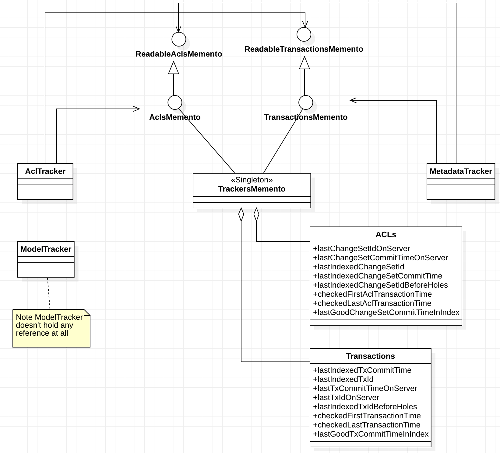

## Tracker State


### Purpose and current implementation
The _org.alfresco.solr.TrackerState_ class represents the state of a given tracker, with several information including the state of the tracker itself and some other data the system needs to remember about the ongoing tracking process.
The state definition within the _TrackerState_ is actually the union of all attributes needed by the all trackers during their lifecycle.

The following table illustrates the member instances currently defined in the _TrackerState_, together with the indication of the tracker which makes use of that specific information. 

| Property                  | READ    | WRITE | Notes|     
| --------------------------|:----------:|------------------------------------|:------------|
|lastChangeSetIdOnServer|ACLTracker|ACLTracker  | |
|lastChangeSetCommitTimeOnServer|ACLTracker|ACLTracker| |
|lastIndexedChangeSetId*|ACLTracker, MetadataTracker::getShardState|ACLTracker| |
|lastIndexedTxCommitTime|MetadataTracker|MetadataTracker| |
|lastIndexedTxId|MetadataTracker|MetadataTracker| |
|lastIndexedChangeSetCommitTime*|AclTracker, MetadataTracker, AbstractTracker::continueState|AclTracker| |
|lastTxCommitTimeOnServer|MetadataTracker|N.A.| |
|lastTxIdOnServer|MetadataTracker|MetadataTracker| |
|lastIndexedTxIdBeforeHoles|MetadataTracker|N.A.| |
|lastIndexedChangeSetIdBeforeHoles|AclTracker| N.A.| |
|running|ALL|ALL||
|checkedFirstTransactionTime|MetadataTracker|ACLTracker, MetadataTracker| |
|checkedFirstAclTransactionTime|ACLTracker|ACLTracker| |
|checkedLastAclTransactionTime|ACLTracker|ACLTracker| |
|checkedLastTransactionTime|MetadataTracker|MetadataTracker| |
|check|AclTrackerTest|AbstractTracker, CoreAdminHandler::actionCHECK| It seems used only for ACL test purposes, but it is set on the superclass on all trackers|
|trackerCycles|ALL |ALL | |
|timeToStopIndexing|AclTracker, MetadataTracker|MetadataTrackerTest, SolrInformationServer::getTrackerInitialState |Since it is set in the initial tracker state, it is done for all trackers, but actually it is never set again so the MetadataTracker and AclTracker always  use the initial value.  |
|lastGoodChangeSetCommitTimeInIndex|AclTracker|AclTracker, SolrInformationServer::getTrackerInitialState, SolrInformatonServer::continueState|SolrInformatioServer::continueState is called  on every tracker. However, only the AclTracker is using this information.  |
|lastGoodTxCommitTimeInIndex|MetadataTracker|MetadataTracker, SolrInformationServer::getTrackerInitialState, SolrInformatonServer::continueState| See above|
|timeBeforeWhichThereCanBeNoHoles|N.A.| SolrInformationServer::getTrackerInitialState, SolrInformatonServer::continueState | This is set for all trackers but never read.|
|lastStartTime| ALL|ALL ||

_* as part of the MNT-20179, which is being implemented at time of writing, the MetadataTracker won't access anymore to this attribute_

From the table above we can see there are some intersections between attributes and trackers; specifically we have three different scenarios:

- n writers, 1 reader (e.g. lastGoodChangeSetCommitTimeInIndex)
- n readers, 1 writer (e.g. lastIndexedChangeSetCommitTime, lastIndexedChangeSetId)
- n readers, n writers (timeToStopIndexing)

These scenarios suggest the "unified" approach used within the _TrackerState_ could be improved. Specifically: 

- n writers, 1 reader: dangerous, we need to clarify if the usage of the same property is disjoint or the two writers are supposed to insist on the same property instance/value.
- n readers, 1 writer: this could be ok, because only one tracker is mutating the property value.
- n readers, n writers: this is the worst scenario; however, it seems only one property (timeToStopIndexing) falls here so the context should be easy to understand and address.

### Thoughts about the current implementation
The current implementation of the _TrackerState_ contains a "mix" of information that can be roughly classified in two categories: 

- things that below to the "stateful" context of the tracker lifecycle (e.g. running, checked, trackerCycles): as a side note, in a refactoring context we need to consider that each tracker instance has also some attribute which belongs to this category but it's not part of the _TrackerState_ (e.g. rollback)
- things we want to remember across the tracker cycles (e.g. lastIndexedTxId, checkedFirstTransactionTime)

The first category is tied to a tracker instance and therefore can be considered part, strictly speaking, of the tracker state. 
The second category instead, seems to be something shared across the trackers; that is, a place where each tracker (actually only the _MetadataTracker_ and the _AclTracker_ plays a role in this context) can record some information during a tracking cycle. 

The _TrackerState_ creation and initialisation is done in _SolrInformationServer_ (a singleton within each _SolrCore_); at the end of the subsystem initialisation, each tracker has an its own _TrackerState_ instance. Looking at the two points above, 
that dedicated instance sounds reasonable for the first category (the stateful context of a tracker) while it doesn't make so much sense for the second one. This because each tracker owns a private, decoupled instance of the tracker state but:

- in the best case it will use only a disjoint and partial portion of that class
- in the worst case it will never use that

As consequence of that, a proper design should divide those two responsibilities, by providing a private copy of the state and a shared instance composed by things we need to remember across tracker cycles. 
This approach is the main driver of the proposal described in the next section. 

### Proposal 
As explained above, the proposal would divide the current tracker state in two separate set of attributes.

#### Tracker State
This set includes things that are strictly related with the current state of a tracker (e.g. running, isInRollback, isInMaintenance). These properties are specific for each tracker, they could be expressed in two ways: 

- as instance properties of each tracker (in _AbstractTracker_ or in the concete tracker class)
- using a State Pattern [1], in order to formalize the behaviour that a given tracker should have when it is in a specific state. 

Using the first approach, variables like "running", "check", "trackerCycles" should be moved and managed directly or indirectly (_AbstractTracker_) in the tracker class. Each tracker instance must own a private copy of that variable because it can differ between trackers (e.g. _MetadataTracker_ could be running while _AclTracker_ couldn't)

```Java 

public abstract class AbstractTracker {
 
    private boolean running;
    
    ...
    
    
    public boolean isRunning() {
        return running;
    }
    
    public void doTrack() {
        
        if (isRunning) {
            // Do something 
        } else {
            // Dom something else
        }
    
    }
}

```

The second approach would transform each tracker in a Finite State Machine (FSM) [2]. Since at the moment the different behaviour is spread across the code with a relevant amount of conditional statements, this approach requires more analysis and implementation effort. 
The concrete Tracker (or the _AbstractTracker_) would act as a controller which would orchestrate and move between available states, in order to execute the tracking logic.  

#### Tracker Memory/Memento
This set of attributes includes all things we need to remember across tracker cycles. The term "Memento" is taken from the popular GoF Design Pattern [3] 
but in this context the usage is slightly different because here we aren't interested in retain a captured state for doing things like undo/redo operations: the purpose is to persist a set of information between one tracking cycle and another.

Under this perspective, the Memento/Memory should act as a singleton across all trackers: that is, there should be only one instance for each _SolrCore_. This class will contain all information copied from the _TrackerState_ related with ACLs and Transactions:

```
public class TrackersMemento {
        
        // ACLs and Transactions are two private inner classes used just for classifying things within 
        // this class. They are not exposed and the caller sees only the TrackersMemory public interface (getters and 
        // setters)
        
        private class ACLs {
           private long lastChangeSetIdOnServer;
           private long lastChangeSetCommitTimeOnServer;
           private long lastIndexedChangeSetId;
           private long lastIndexedChangeSetCommitTime;
           private long lastIndexedChangeSetIdBeforeHoles = -1;
   
           private volatile boolean checkedFirstAclTransactionTime;
           private volatile boolean checkedLastAclTransactionTime;
   
           private long lastGoodChangeSetCommitTimeInIndex;
        }
   
        private class Transactions {
           private long lastIndexedTxCommitTime;
           private long lastIndexedTxId;
           private long lastTxCommitTimeOnServer;
           private long lastTxIdOnServer;
           private long lastIndexedTxIdBeforeHoles = -1;
   
           private boolean checkedFirstTransactionTime;
   
           private boolean checkedLastTransactionTime;
   
           private long lastGoodTxCommitTimeInIndex;
        }
   
       private final ACLs acls = new ACLs();
       private final Transactions transactions = new Transactions();
   
       // getter and setter at hosting instance level

```

With this class, the tracker subsystem will expose a centralized view of things that need to be recorded. This is the first important difference: 
in the current implementation each tracker has a copy of (for example) "lastIndexedTxId" regardless if it uses it or not. 

Once we got the centralization, a proper design would enforce/formalize the read/write access to that properties. The purpose is to communicate in a formal way 

- who is allowed to write what
- who is allowed to read what

So, looking at the table at the beginning of this document, after removing things belonging to the tracker state (section above), 
we can group the remaining properties using two categories (ACLs and Transactions) which can be furtherly split from the access perspective (Read and/or Write).

So the idea is to create four interfaces, all implemented by the _TrackersMemento_ which would enable

- ACL properties read access (e.g. _ReadableOnlyAclsMemento_) which will contains all getters related with the _TrackersMemento::ACLs_ properties
- ACL properties write (and read) access (e.g. _AclsMemento_ extends _ReadableOnlyAclsMemento_) which will contains all setters related with the _TrackersMemento::ACLs_ properties
- Transaction properties read access (e.g. _ReadableOnlyTransactionsMemento_) which will contains all getters related with the _TrackersMemento::Transations_ properties
- Transaction properties write (and read) access (e.g. _TransactionsMemento_ extends _ReadableOnlyTransactionsMemento_) which will contains all setters related with the _TrackersMemento::Transactions_ properties

The _TrackersMemento_ would implement all four interfaces: 

```

// ReadableOnly intefaces are automatically inherited

public class TrackersMemento implements AclsMemento, TransactionsMemento {
```   



Using the class hierarchy above, we could improve the formalisation of the different kind of access each tracker would require. Specifically:

- the memento instance could be available or not in each tracker. That probably means it doesn't make sense to have it available at the _AbstractTracker_ level.
- a tracker or a component, depending on its requirements and behaviour, could have a reference to a readable and/or writable (ACLs and/or Transactions) memento. 

For example: 

- _ModelTracker_ won't have any reference because it doesn't need it
- _ACLTracker_ would see an _AclsMemento_ with full RW access but a Read-Only view of the _TransactionsMemento_
- _CoreAdminHandler_ would have a Read-Only view of both ACLs and Transations memento
- _SolrInformationServer_ would a a full access to the _TrackersMemento_, because it create and initialise it

### Single or Multi Core
Being a Singleton, the _TrackerMemento_ could be also designed for storing/serving data belonging to more than one core. 
This could be useful if the same Solr instance hosts multiple core (e.g. alfresco, archive). In that case the access interfaces and the access pattern would be slightly different 
because it should be implemented for taking in account also the core name as input parameter. 

The resulting implementation should provide a 1-n cardinality relationship (by means of a dictionary, for example) between the memento instance and the internal stored sets of attributes belonging to different cores. 

***
[1] [State Pattern](https://en.wikipedia.org/wiki/State_pattern)    
[2] [Finite State Machine](https://en.wikipedia.org/wiki/Finite-state_machine)   
[3] [Memento](https://en.wikipedia.org/wiki/Memento_pattern)   