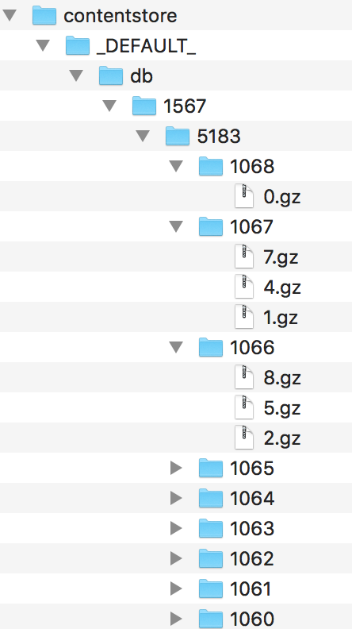

# 1. (Solr)ContentStore Replication

Date: 2019-24-09

## Status
Accepted

## Context
Solr Index Replication distributes a copy of a master index to one or more slave servers. 
The master server is in charge to manage updates to the index while all querying is handled by the slaves. 
This division of labor enables Solr to scale to provide adequate responsiveness to queries against large search volumes.      
  

_(Source: Apache Solr Reference Guide)_      

SearchServices, being a set of extensions written on top of Apache Solr, leverages this mechanism for replicating the index. 
However, there's an external part of data which is managed out of the plain Lucene index: the ContentStore.   
   
A ContentStore is composed by several files, specifically one for each indexed document; each of them is a SolrInputDocument instance stored on filesystem using a 
serialized and compressed form.   

The ContentStore is where SearchServices maintains the input data in its original form, before entering in Solr and therefore before 
applying any text analysis. This source of data is needed for managing some search-related capabilities like: 

- fingerprinting
- highlighting
- clustering 
- stored (i.e. original) field value retrieval at query time 

In a master/slave(s) infrastructure, the ContentStore must be managed on the master and it must be replicated on each slaves.    
Unfortunately, the default built-in Solr replication mechanism considers only: 

- the Lucene index datafiles
- the configuration files under the core "conf" folder (e.g. schema.xml. stopwords.txt) 

As consequence of that, if we use the default Solr ReplicationHandler the ContentStore won't be replicated on slaves.  

### How the built-in Solr ReplicationHandler works
The index replication mechanism is provided by org.apache.solr.handler.ReplicationHandler. 
The component is quite complex because it contains the logic needed on both sides (master and slave) and therefore plays a different workflow depending on the role of the Solr node:

- **MASTER**: the node is responsible to manage the index as consequence of deletes, adds, updates. The replication handler doesn't play an active role here; it just takes care about incrementing the index version, other than providing the required endpoints for retrieving the index datafiles 
- **SLAVE**:  the node maintains a local index version and (when the replication is enabled) periodically polls the master in order to detect index changes that need to be replicated
- **REPEATER**: a node that acts at the same time as a MASTER and SLAVE. It is used as an intermediate node for replicating the index when slaves are on a different datacenter  

The _CommitVersionInfo_, which drives the replication process, is composed by two different values: 

- **index version**: a number indicating the index version; it is timestamp-based and it changes every time an update (i.e. add, delete) is applied to the index
- **generation**: a lucene index is composed by several segments. Each of them has a progressive identification number called "generation". The one with the largest generation is the active one; from a replication perspective, the generation number doesn't actually indicate the "active" segment, but instead the current 'replicateable' one.

#### Available services
There is only one single endpoint (/replication) provided by the ReplicationHandler.    
Then, through a "command" request parameter we can indicate the logical "endpoint" we want to execute.    
The available commands are listed in the following table; an additional column reports if the customisation we are going to implement has some impact on it. 

The following table lists the available sharding methods and the associated mnemonic codes (i.e. the value of the "shard_method" attribute we need to configure in solrcore.properties).

|Command|Description|
|----|-----|
|indexversion|Returns the version (index version + generation) of the latest replicatable index on the specified master or slave.|
|filecontent|Returns the stream reference for a given file. It is used for replicating a file that needs to be synched. |
|filelist|Returns the list of index files associated with a given generation and all configuration files included in the replication |
|backup|An asynchronous call, which will backup data from the latest index commit point.|
|restore|Restores an index snapshot into the current core. |
|status|Backup status|
|restorestatus|Restore status|
|deletebackup|Deletes an index snapshot previously created. |
|fetchindex|Forces the specified slave to fetch a copy of the index from its master.|
|enablepoll|(Slave only) enables the polling on a slave node|
|disablepoll|(Slave only) disables the polling on a slave node|
|enablereplication|(Master only) Enables replication on the master for all its slaves.|
|disablereplication|(Master only) Disables replication on the master for all its slaves.|
|details|Returns the replication status and the current node configuration|
|commits|Gets the commit points for the index.|

#### Workflow

As briefly mentioned, the runtime logic of the ReplicationHandler depends on the role of the hosting Solr node.

##### Master

When the node is a master, the main responsibilities, from a replication perspective, are: 
 * **update the index version and generation**: The index version is the actual trigger of the replication mechanism. The index version is incremented / updated each time a change (or a set of changes) is applied to the index, while the generation follows a similar path but it directly maintained at low level by Lucene. 
 * **expose the relevant endpoints** needed and called by the slaves for replicating the data.
 
##### Slave 

In the "Slave" mode, other than providing more or less the same endpoints seen above (with a slightly different semantic, indeed), the main difference is the "active" role played by a background thread which, simplifying, performs the following operations: 
 * get the latest index version and generation (command=indexversion) from the master and from the slave
 * if the versions are the same then no replication happens, otherwise
 * a temporary directory which will hold the downloaded data is created (index.<timestamp>)
 * the list of files to be replicated is fetched (command=filelist); this includes datafiles and configuration files
 * for each file that needs to be replicated retrieve and download the content (command=filecontent)

Internally, the set of downloaded data files could change, because Solr could decide to download only a part of the index or a full copy. 

## Decision
The SearchServices replication mechanism needs to include also the ContentStore as part of the synchronization workflow.
In order to do that, the additional behaviour requires a customisation of the workflow provided by the default Solr ReplicationHandler, as explained below. 

### Alfresco Replication Handler Design
The Alfresco ReplicationHandler is, as the name suggests, a customisation of the default Solr ReplicationHandler described above. 
The customisation injects some additional logic on both side of the replication mechanism in order to efficiently replicate the content store.   

#### Master
The master maintains, for each core, a versioning history of the owned data which consists of:

- the underlying Lucene index
- configuration files (if they have to be versioned/replicated)
- content store (if the content store replication is enabled)
     
The master replication handler configuration will declare the new ReplicationHandler class in the solrconfig.xml and it will have an additional attribute 
which indicates the absolute path of the content store root folder.

The "version" number associated with a set of changes is incremented after a persistent change (i.e. hard commit) in the Lucene index.    
Note this behaviour is already implemented in the default ReplicationHandler, so that means we will inject the additional logic required for the content store as part of such mechanism.    
Specifically, we will use the version number (aka indexversion*) also for storing content store changes.   

The content store changes will be stored in a separate Lucene Index, with must respect the following requirements:

- it must be present only on master nodes 
- it must be initialised on-demand, even from scratch, in case of absence  
- it must associate the indexversion to a set of content store changes (deletes and adds)
- it must answer efficiently to the following query: given two index versions S and M, where S < M, give me all documents (i.e. content store changes) between S and M, sorted by commit timestamp asc
 
The ideal candidate class where this index should be facaded is SolrContentStore. The class, other than dealing with filesystem changes, would also manage the Lucene index by executing RW operations.
The SolrContentStore would execute and collect all changes that will be flushed in a new document of that internal index when the CommitTracker executes a commit.   

The existing endpoints on the master side described in SEARCH-1838 would be slightly changed in the following way:
    
|Command|Notes|Impact|
|----|----|----|
|indexversion|Returns the version (index version + generation) of the latest replicatable index on the specified master or slave.|NO|
|filecontent|The command itself won't change. The difference will be in the additional content store stream handler|YES|
|filelist|There will be an additional "content store" section which would list the content store changes that must be synchronized. Specifically, the "deletes" section will be a list of items, while the "upserts" would be a virtual file (something like contentstore://blalbalba) that corresponds on the master side to the optimized stream used for transferring upserts (new adds or updates)   |YES|
|backup| |NO*|
|restore| | NO* |
|status| | NO*|
|restorestatus| |NO*|
|deletebackup| |NO*|
|fetchindex|We will include also a configurable option where the fetch will include also the content store.  |YES|
|enablepoll| |NO|
|disablepoll| |NO|
|enablereplication| |NO|
|disablereplication| |NO|
|details|We will include some detail about the content store.|NO|
|commits| |NO|

The content store is an Alfresco concept and it is currently manually backed up.   
In terms of design we would want it to the backup as well; however, the design described in this document is not related with that set of functionalities; 
although the backup management consists of a set of services provided by the ReplicationHandler, we believe it's better to create a dedicated issue that will focus on that complex aspect.       
 
#### Slave
   
The slave configuration (from the Alfresco replication perspective) would be exactly the same on slave nodes.
Other than providing the same capabilities of the built-in handler, it will also indicate the absolute path of the content store root folder.

The workflow on the slave node would follow the existing path: 
 * a slave should persist the latest applied content store version somewhere (e.g. a file called .version). If that version doesn't exist then the slave needs to get the whole content store.
 * at a scheduled intervals (see the "pollInterval" above) the slave polls the master using the "indexversion" command, in order to get the latest "replicateable" version of the master data
 * if the version on the slave is equal to the version on the master then nothing happens
 * if the slave version is lesser than the master version, then the replication starts**
 * the slave issues a "filelist" commands for retrieving the list of changes (i.e. index changes, configuration files changes and content store changes)
 * the slave asks and downloads index files
 * the slave asks and downloads configuration files
 * the slave downloads and applies the content store adds 
 * the slave executes the deletes on the content store
 * the content store version number is updated in the slave  
 
_* the Solr replication handler actually uses 2 numbers for indicating the version: the first is called "indexversion" and it is mainly responsible for triggering the replication process. The second is the Lucene generation, that is: the number of the last active segment in the lucene index. For our purposes, we can ignore the generation and use only the indexversion._      
 ** _if the master version is lesser than the slave version, then something strange happened between the two indexes: the only thing we can do is to replicate the whole content store (the same thing happens with the Lucene index)_    

## Consequences
The new replication mechanism will be able to properly synchronize, from master to slave(s), the whole logical "index" belonging to 
the SearchServices master node. As explained above, that includes:

- the Lucene index datafiles 
- the configuration files under the "conf" folder
- the ContentStore  