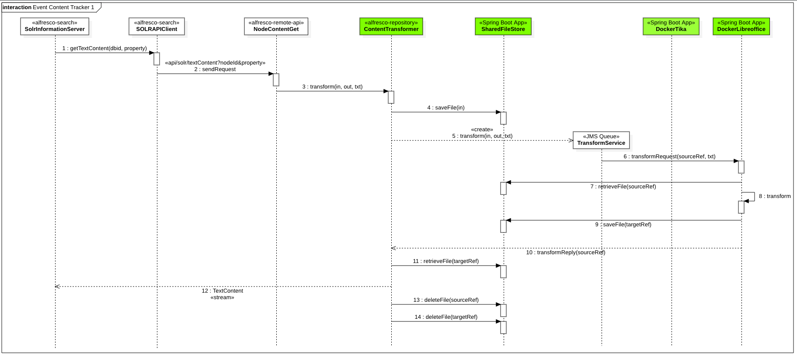

# Event Based Content Tracker for Alfresco


## Context

The current approach of the Content Tracker in Search Service is to query Solr for any *dirty* documents which it then fetches from Alfresco. Once the content is successfully obtained from Alfresco, it marks it clean which eventually get committed to the index. This approach will need to be modified as it applies pressure on Alfresco on every call to get the content. Taking an event based approach where the Content Tracker subscribes to a *topic* with policy the specific behaviour will allow to get the extracted content when ready.

There are currently different alternatives to be considered:

1. No change to Search Service. The repository will off load the transformation to Transformation Service and pause the thread requesting the transformation until the content is transformed.
2. Introduce a new microservice that sits between Search Service and the Transformation Service. The content is off loaded to Transformation Service and the microservice stores the content for Search Service to ingest.
3. The Content Tracker that consumes content based on events

This document describes and explores these alternatives to provide the background required to produce an **ADR** (Architectural Decision Record) related to this topic.


## How Text Extraction Works

Following information has been extracted from Alfresco Content Services 6.1 and Alfresco Search Services 1.3.


**Components referenced in the figure**

* [alfresco-search](https://github.com/Alfresco/SearchServices/tree/master/alfresco-search): Alfresco SOLR Application, deployed in SOLR Jetty web application `solr.war` as library
* [alfresco-remote-api](https://github.com/Alfresco/alfresco-remote-api): REST API Layer for Alfresco Content Services, deployed in Alfresco Tomcat web application `alfresco.war` as library
* [alfresco-repository](https://github.com/Alfresco/alfresco-repository): Metadata and content storage for Alfresco Content Services, deployed in Alfresco Tomcat web application `alfresco.war` as library
* [Apache Tika](https://github.com/Alfresco/alfresco-tika): Detection and extraction of metadata and text from content, deployed in Alfresco Tomcat web application `alfresco.war` as library
* [LibreOffice](https://www.libreoffice.org): This program is used in *serverless* mode to provide content transformation, installed locally on a server. It can be used *DIRECT* as TCP service (usually listening in port 8100) or via [JodConverter](http://docs.alfresco.com/community/concepts/OOo-subsystems-intro.html).

**Text Extraction Process**

Since more detailed information on the Content Tracker [1] is available, the text extraction process happens inside `SolrInformationServer` class. When *dirty* documents are being indexed, `SOLRAPIClient` is invoked (1) to retrieve Text Content from Alfresco Repository using the REST API (2)

```
/api/solr/textContent?nodeId=<id>&propertyQName=<name>
```

* `id` is the identifier of the document in database
* `propertyQName` is the identifier of the property representing the content of the document, `{http://www.alfresco.org/model/content/1.0}content` by default

Both classes are part of [Alfresco Solr Application](https://github.com/Alfresco/SearchServices/tree/master/alfresco-search).

The request to `textContent` is processed by `NodeContentGet` Web Script (3) at [Alfresco Remote API](https://github.com/Alfresco/alfresco-remote-api). This component finds the right Content Transformer to produce the required Text Content from the original mime type. *Apache Tika*, as local class invocation, and *LibreOffice*, as TCP service or using JodConverter [2], are the Content Transformers available.

Once the transformation has been performed (4) by the Content Transformer, the Stream is returned back to `SolrInformationServer` (5) and the indexing process continues.

*Note*: `NodeContentGet` web script is using a deprecated API to find the right transformer: [getActiveTransformers()](https://github.com/Alfresco/alfresco-repository/blob/alfresco-repository-7.60/src/main/java/org/alfresco/repo/content/ContentServiceImpl.java#L897).


## How the New Transform Service Works

Before going on with the alternatives evaluation, a quick overview of the new **Alfresco Transform Service** is provided.

Since ACS 6.0, transformations are performed by different *microservices* named as *Transform Engines* (T-Engine):

* [alfresco-docker-alfresco-pdf-renderer](https://git.alfresco.com/Repository/alfresco-docker-transformers/tree/master/alfresco-docker-alfresco-pdf-renderer) includes a PDFium [3] *wrapper* named Alfresco PDF Renderer [4] to provide operations on PDF files, as extracting the first page
* [alfresco-docker-imagemagick](https://git.alfresco.com/Repository/alfresco-docker-transformers/tree/master/alfresco-docker-imagemagick) includes an ImageMagick [5] *wrapper* to provide operations on images, as generating a thumbnail
* [alfresco-docker-libreoffice](https://git.alfresco.com/Repository/alfresco-docker-transformers/tree/master/alfresco-docker-libreoffice) includes a LibreOffice *wrapper* to provide transformation operations from a source mime type to a target mime type
* [alfresco-docker-tika](https://git.alfresco.com/Repository/alfresco-docker-transformers/tree/master/alfresco-docker-tika) exposes Apache Tika [6] features for mime type transformation

A *Transform Engine* is a dockerized REST API providing transformation services and *renderization* operations. The [Transform Service](https://github.com/Alfresco/alfresco-transform-service) is a message router, currently working with ActiveMQ, to provide Transformation Requests to Transform Engines and to manage Transformation Replies from Transform Engines. This *router* finds the right Transform Engine for a Transformation Request depending on the source and target mime types.

To reduce the transit of content between the services, a dockerized [Shared File Store](https://github.com/Alfresco/alfresco-shared-file-store) REST API is used to have a single point of storage. When a transformation operation is requested, the source file is uploaded to the *Shared File Store* and when the transformation operation has been performed, the target file is uploaded also to that *Shared File Store*. Once the operation has been consumed, both source and target files are removed from *Shared File Store*.


**Components referenced in the figure**

* [T-Client](https://github.com/Alfresco/alfresco-repository/blob/alfresco-repository-7.60/src/main/java/org/alfresco/messaging/camel/routes/OnContentUpdateRenditionRoute.java#L88): Currently ACS is a transformer client, requesting transformation operations to *Transform Service* via JMS events
* [Shared File Store](https://github.com/Alfresco/alfresco-shared-file-store): REST API Layer to share contents between a *T-Client* and the *T-Engine*
* [T-Service](https://github.com/Alfresco/alfresco-transform-service): Alfresco Transform Service to route JMS Events to T-Engines
* [T-Engine](https://git.alfresco.com/Repository/alfresco-docker-transformers): Transformation Engines provides transformation operations on content, consuming the source from `Shared File Store` and producing the target also in `Shared File Store`. Currently Apache Tika, LibreOffice, ImageMagick and PDF Renderer are available

**Transformation Process**

*T-Client* uploads the source content to `Shared File Store` using a REST API invocation (1) to retrieve a *srcContentRef* (2).

After that, *T-Client* creates a new `TransformRequest` event with the *srcContentRef* and the requested operation (3).

*T-Service* consumes the event and invokes to the right *T-Engine* (LibreOffice, ImageMagick, PdfRenderer, Apache Tika) with the *srcContentRef* and the operation requested (4).

The *T-Engine* performs the transformation (5) and stores the result in the `Shared File Store` to retrieve a *targetContentRef* (6).

*T-Service* creates a new `TransformReply` event with the *targetContentRef* that is consumed by *T-Client* (7), where the transformed content is downloaded from `Shared File Store` using a REST API invocation (8). After that, for instance, this downloaded content is stored in the repository as a new *rendition*, so the temporary copy at `Shared File Store` is not required anymore.

Both source and target files can be deleted from `Shared File Store` after the operation ends successfully (9).

*Note*. Detailed JSON syntax for `Transform Request` and `Transform Reply` are available at [Spec for Transform Request & Reply](https://github.com/Alfresco/alfresco-transform-service/blob/master/docs/transformation-request-reply.md)


## Alternatives evaluation

Below different alternatives for integrating Content Tracking with the New Transform Service are described.


### 1 - No Change to Search Service

The repository will off load the transformation to Transformation Service and pause the thread requesting the transformation until the content is transformed.



**Components referenced in the figure**

* [alfresco-search](https://github.com/Alfresco/SearchServices/tree/master/alfresco-search): Alfresco SOLR Application, deployed in SOLR Jetty web application `solr.war` as library
* [alfresco-remote-api](https://github.com/Alfresco/alfresco-remote-api): REST API Layer for Alfresco Content Services, deployed in Alfresco Tomcat web application `alfresco.war` as library
* [alfresco-repository](https://github.com/Alfresco/alfresco-repository): Metadata and content storage for Alfresco Content Services, deployed in Alfresco Tomcat web application `alfresco.war` as library
* [Shared File Store](https://github.com/Alfresco/alfresco-shared-file-store): REST API Layer to share contents between a *T-Client* and the *T-Engine*
* [T-Service](https://github.com/Alfresco/alfresco-transform-service): Alfresco Transform Service to route JMS Events to T-Engines
* [DockerTika](https://git.alfresco.com/Repository/alfresco-docker-transformers/tree/master/alfresco-docker-tika) REST API Layer for *T-Engine* based in Tika
* [DockerLibreoffice](https://git.alfresco.com/Repository/alfresco-docker-transformers/tree/master/alfresco-docker-libreoffice) REST API Layer for *T-Engine* based in LibreOffice

**Transformation Process**

From SOLR side, the code remains unchanged, so the transformation to text is requested to `NodeContentGet` web script (2) as before.

From this point, *Content Transformer* stores the source content in the `Shared File Store` to retrieve the `sourceRef` (4) and creates a new *Transform Request* event to be consumed by *Transform Service* (5).

*Transform Service* uses routing component to find the right *Transform Engine* (Tika, LibreOffice...) and perform the invocation with the `sourceRef` and the target media type (TXT) to the *Transform Engine* (6).

Source Content is retrieved from `Shared File Store` using `sourceRef` (7) and the transformation is performed (8) and the result is stored in the `Shared File Store` to retrieve the `targetRef` (9).

After that, *Transform Engine* creates a new *Transform Reply* event (10) to be consumed by *Content Transformer*, where the content is retrieved from `Shared File Store` using `targetRef` (11).

As the original request to `NodeContentGet` has been paused while performing the transformation, *Content Transformer* returns the TextContent Stream back and the response is delivered to SOLR (12).

Both source and target files can be deleted from `Shared File Store` after the operation ends successfully (13,14).

**Consequences**

No consequences for *Search Services* are expected from applying this alternative. Probably then only one is that the whole indexing process will become slower, as the transformation is performed by the new Transform Service and contents are uploaded and downloaded using HTTP protocol. Anyway, this problem can be overcome by providing the right resources to Transform Service.
