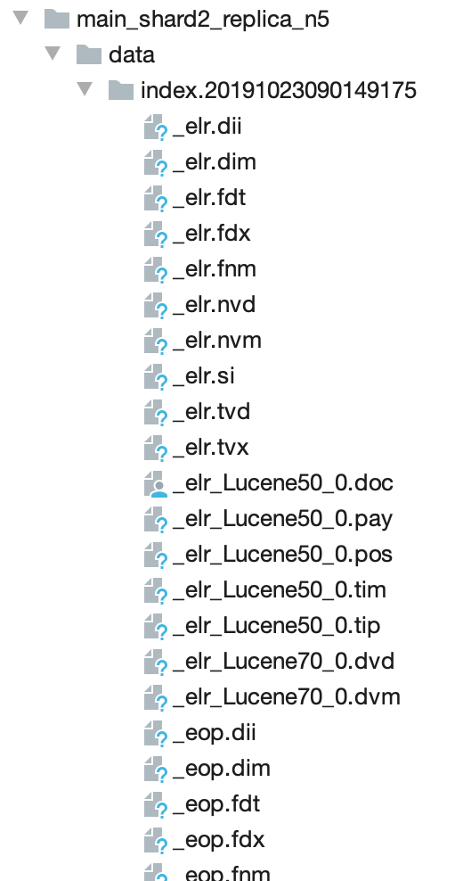
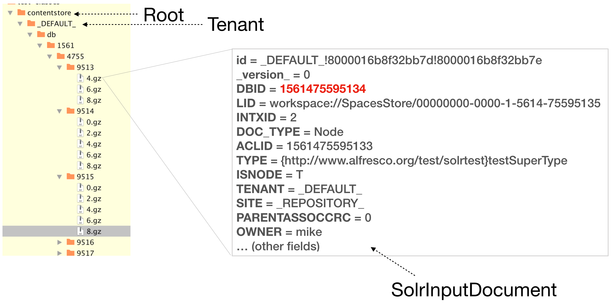
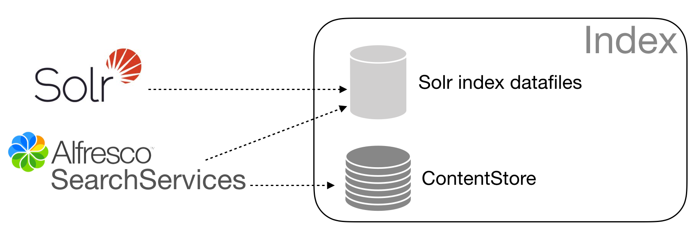
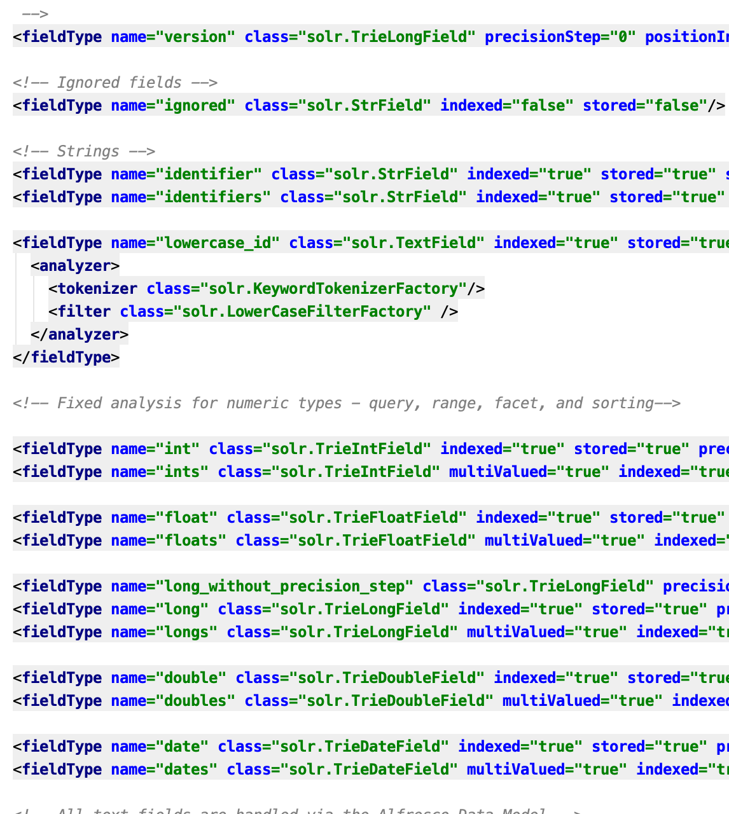
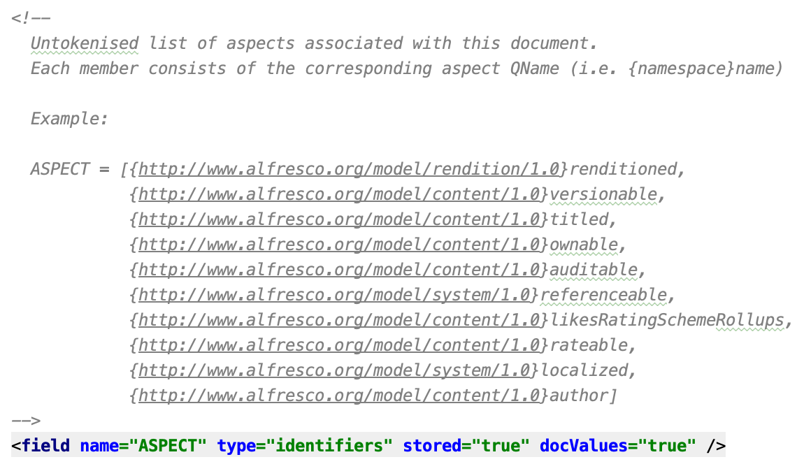

## SolrContentStore Removal

### Status

### Context
SearchServices is a set of Alfresco specific customisations built on top of Apache Solr, a highly reliable, scalable and 
fault tolerant search platform.  
Apache Solr provides efficient search services on top of a given set of data composed by atomic units of work called "documents". 

Content managed in Alfresco that needs to be "searchable" must be sent to Solr for "indexing".    
In the indexing phase Solr store the incoming data and organises it in an immutable data structure called "Inverted Index" 
plus some additional data structures needed for the complementary services offered by the platform
(e.g. highlighting, verbatim storage, more like this).    

The following picture illustrates the content of the data directory managed by Solr

 

SearchServices adds an auxiliary organisation structure, filesystem based, called "Solr Content Store":

  

### What is the SolrContentStore?
The _SolrContentStore_ is a logical extension of the Apache Solr Index where SearchServices maintains a serialised copy of 
each incoming document (i.e. Node). It is a local SearchServices folder organised by tenant that contains all input documents 
indexed in Solr. Within that folder, each file   

- is organised hierarchically, under a root folder (called "contentstore") and per tenant. 
- represents a single document sent to Solr for indexing
- is compressed (.gz) and serialised (using a custom Codec). Specifically, it consists of a serialization of a _SolrInputDocument_ instance,
 the Java class used by Solr for representing an incoming document that is going to be indexed.  

Data that needs to be indexed is retrieved from Alfresco (_Node_ is the composite class representing the main Alfresco 
Domain Object) and then 

- each _Node_ instance is converted to a _SolrInputDocument_ instance
- each _SolrInputDocument_ instance is stored (e.g. compressed and serialised) into the content store
- each _SolrInputDocument_ instance is sent to Solr 

  

With that flow in mind, at a given time T, the main difference between a document D in the content store and in the Solr 
index is that: 

- the content store file represents a verbatim copy of the _SolrInputDocument_ created starting from the corresponding _Node_
- it can be easily individuated because it corresponds to a single file in the content store
- the Solr document definition doesn't have a "single" representation in the filesystem because it has been passed through
the text analysis process. 

### Apache Solr Domain Model
In order to understand the reason why the content store approach has been adopted until SearchServices 1.4.x, we need to 
briefly describes how Solr manages the fields of the indexed documents.

In Solr, the configuration file where fields are declared and configured is called "schema.xml". Each field can have 
different attributes that define 

- how it is internally organised
- what search features are enabled (for that specific field)

In this context we are interested in two specific attributes: "indexed" and "stored". A field in Solr schema can be declared
as "stored" and/or "indexed":

- if the field is indexed (i.e. indexed="true") that means search features are enabled for that field (i.e. search, faceting, sorting)
- if the field is stored (i.e. stored="true") the verbatim copy of the incoming field value is stored and can be returned as part of search results. 

In the SearchServices 1.4.x schema: 

- all fields are marked as indexed: this is quite obvious because we want to enable search features on them
- 99% of fields are marked as non stored: this because SearchServices **retrieves the stored content from the Content Store**  

There are actually only three fields marked as stored: id, DBID and _version_. The last one is a Solr internal field used for some 
features like atomic updates and optimistic locking (both of them are not used in SearchServices).

Assuming there's some data indexed in Solr, the following a query:   

_http://<host>:<port>/alfresco/afts?q=*_    

produces a response containing the first 10 results: each entry is composed only by the three fields above. 

### When the Solr Content Store is used
As described above, SearchServices doesn't make use of Solr storage capabilities, so the rule is: the Solr 
Content Store is involved on each interaction which requires the stored content. That includes: 

- **Fields retrieval**: Solr stored only DBID, id and version fields; in search results we want to be able to retrieve 
also other fields (e.g. name, title, LID, PATH) 
- **Highlighting**: highlighted snippets are built using the fields stored value  
- **Clustering**: runtime clusters definition use the fields stored value as well  
- **Fingerprint**: the Fingerprint Search Component returns the (stored value of the) MINHASH field computed from the text content associated 
with a given document    
- **Text Content Management**: this is strictly connected with how the _ContentTracker_ workds. See this [ADR](../trackers/00001-content-tracker.md) for a detailed exaplanation about how text contente is managed in SearchServices.

### Read/Write Path on Solr Content Store 
Every time a search request involves one of the points listed in the previous section we need to interact

- with the Solr index
- with the Solr Content Store

The Solr Content Store interaction can have two purposes:    

- **Read only**: we need to read the stored fields associated to one or more documents 
- **Read/Write**: we need to read and update the document definition (i.e. some field has been updated)

The paths execution consists of additional I/O and CPU work on top of what Solr already does; 
the two flows described below need to be executed for each document involved in the search interaction.

The **Read Path** consists of the following steps (again, for each match produced by the search execution): 

- Locate the .gz file corresponding to a given DBID
- Uncompress the .gz file
- Deserialise the file in a _SolrInputDocument_ instance
- Use the fields values in the instance in order to perform the required task (e.g. fields retrieval, highlighting)   

A first important thing about the flow above to be highlighted: it's not possible to load in memory only the fields we need.
Every time the document D is needed (even if our interaction requires just one field) the whole document definition needs
to be 

- located
- uncompressed
- deserialised
- read

Such capability is instead possible using Lucene: the IndexSearcher class can load a partial document definition which
contains only those fields actually needed. For example, if we want to highlight search terms in two fields, let's say 
"name" and "title"

- the AlfrescoHighlighter loads the whole document in memory
- the SolrHighlighter loads only those two fields

This can make a relevant difference if we are in a context where the fields cardinality for each document is high, or if 
we have one or more big fields (not needed) with a lot of text content.   

The **Write Path** is even worst because it adds to the list above the following steps: 

- Update the _SolrInputDocument_ instance with updated values
- Delete the old compressed file in the filesystem
- Serialise the updated _SolrInputDocument_ instance
- Compress the serialised image
- Write a new .gz file
- The _SolrInputDocument_ instance is sent to Solr

### Solr Content Store Removal Benefits

#### Use as much as possible Solr built-in capabilities
The main reason why an open source platform is chosen as underlying framework is its popularity. That means a lot of 
advantages in terms of 

- community
- support
- product improvements (e.g. enhancements, bug fixing)
    
Although the underlying reasons for introducing a customisation could be perfectly acceptable, it's important to keep in 
mind that increasing such customisation level necessarily creates a gap, a distance with the open source product.   
From one side, the customisation allows to implement some functional requirement not covered by the open source version, 
on the other side the same customisation won't have the required support from the community. 

The initial approach to this task consisted of a verification [Spike](https://issues.alfresco.com/jira/browse/SEARCH-1669) where 
we investigated pro and cons about having/removing the SolrContentStore.   
Summarised, the output has been in favour of the removal, because the Solr storage capabilities are definitely more efficient 
than the approach adopted in the SolrContentStore.         
    
#### Less Solr customisations 
This is a direct consequence of the preceding point. As you can read below, when we describe the major components affected 
by the removal task, some customised component (e.g. Clustering) has been removed at all while some other else (e.g. Highlighter) 
has been simplified a lot, leveraging the Solr built-in capabilities as much as possible.    

### Only Solr data files
SearchServices no longer has to manage external files or folders. In SearchServices 1.4.x the content store required a 
relevant effort for [customising]((https://issues.alfresco.com/jira/browse/SEARCH-1669)) the built-in Solr Replication 
mechanism that as you can imagine, it doesn't take in account the Alfresco SolrContentStore.

 

Such customisation has been removed in this branch and it has been replaced by the built-in Solr Replication Handler. 
Last but not least, the whole stored content management has been centralised in Solr: the Read/Write paths described 
above are no longer valid.   
 
### Better compression 
Compressing at single document level is not very efficient because the small amount of data.  
Moving such task at Solr level can deliver good results for two main reason: 

- data cardinality is higher, so that means the compression algorithm can work with representative and efficient stats
- data compression and index organisation is one area where the Solr community dedicated and dedicates a considerable amount of effort        

### Less, more efficient I/O and CPU(compress/decompress) resources usage
This is again related with the Read/Write paths we described above: once the SolrContentStore is removed, we do not have to 
deal with external files and folders and the read, write, compress, uncompress, serialise, deserialise works will be no longer needed. 

### Better OS Page Cache usage
The OS Page Cache is used for storing and caching those files required by the application processed running on a given machine. 
In an ideal context the OS would put the entire Solr index in the page cache so every read operation won't require any disk seek.
Unfortunately, the cache size is usually smaller than that so a certain amount of time is spent by the OS in order to load/unload the
requested files.   

In a context like that, the less number of files we have to manage, the better: having a component like the content store 
which requires a relevant amount of I/O operations, means a significant impact of the hardware resources (e.g. disk, cpu) 
and a less efficient usage of the OS Page cache (e.g. the OS could unload the Solr datafiles for working with Solr content store files).  

## Major Changes
This section provides a high-level description of the components / area that have been affected by the SolrContentStore removal. 

### Solr Schema 
Jira Ticket: [SEARCH-1707](https://issues.alfresco.com/jira/browse/SEARCH-1707)

The Solr schema (schema.xml) includes the following changes:  

- stored attributes: every field is marked as stored. Since this is something we want to apply to all fields, the stored
attribute has been defined on field types.
- cleanup and new field types: there are several new field types that declare the default values applied to a field. 
The naming is quite intuitive (e.g. "long" is a single value numeric field, "longs" is for multiValued numeric fields). 
That change allowed a more clear fields definitions (i.e. fields definitions that don't override default values are very short and concise)

  
 
The most important changes are:        

- comments: sometimes it is very hard to understand the purpose of a field and, most important, what is its runtime content. 
As part of this refactoring you'll find explanations and examples before the most part of the fields in the schema.

  

More detailed information can be found in the JIRA Ticket.

      